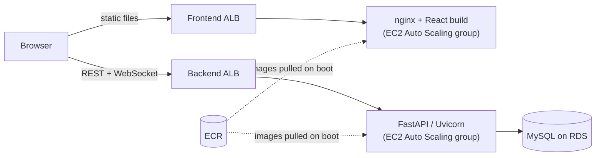

# Drawzy

[](https://github.com/SamLittleJ/Drawzy/actions/workflows/ci.yml)

A real-time multiplayer drawing game. Players create or join a room, receive a random theme each round and draw on a shared canvas against the clock, chatting while they play.

Built end to end as a portfolio project: a **FastAPI** backend with REST and WebSocket APIs, a **React** frontend, **Docker** images, and **Terraform** infrastructure for AWS deployed through **GitHub Actions**.

## Features

- **Accounts:** registration and login with bcrypt-hashed passwords and JWT bearer tokens.
- **Rooms:** public or private rooms with a 6-character join code and configurable player limit, round length and number of rounds.
- **Real-time play over a single WebSocket per player:**
  - live player list and room chat;
  - a shared canvas: brush, eraser, line, rectangle, circle, fill and clear, synced to every player;
  - a server-driven game loop that reveals a theme, runs a timed drawing round and repeats until the game ends.
- **Room lifecycle:** empty rooms are cleaned up automatically, and joins are refused with clear close codes when a room is full or no longer exists.

## Tech stack

| Layer | Technology |
| --- | --- |
| Backend | Python 3.13, FastAPI, SQLAlchemy 2, Pydantic 2, PyJWT, bcrypt, Uvicorn |
| Frontend | React 19, React Router, Vite, Axios, CSS Modules, HTML Canvas |
| Data | MySQL 8 (SQLite for local development and tests) |
| Testing | pytest + FastAPI TestClient, Vitest + React Testing Library |
| Infrastructure | Docker, nginx, Terraform, AWS (EC2 Auto Scaling, ALB, RDS, ECR, S3/DynamoDB state) |
| CI/CD | GitHub Actions (tests on every push, manual deploy via OIDC) |

## Architecture



The REST API handles accounts, rooms and game records. Everything that happens *inside* a room goes through one WebSocket per player at `/ws/{roomCode}?token=<JWT>`:

| Direction | Event | Payload |
| --- | --- | --- |
| client → server | `CHAT` | `{ message }` |
| client → server | `DRAW` | a drawing action, e.g. `{ tool, from, to, color, size }` |
| client → server | `START_GAME` | — |
| client → server | `GET_EXISTING_PLAYERS` | — |
| server → client | `EXISTING_PLAYERS` | full roster, sent on connect |
| server → client | `PLAYER_JOIN` / `PLAYER_LEAVE` | `{ id, username }` / `{ id }` |
| server → client | `CHAT` | `{ user, message }` |
| server → client | `DRAW` | relayed to everyone except the sender |
| server → client | `SHOW_THEME` → `ROUND_START` → `ROUND_END` … `GAME_END` | theme, round number and duration |

Rejected connections are closed with `4401` (invalid token), `4403` (room full) or `4404` (room not found).

Drawing actions are plain JSON objects rendered by a single function ([`drawing.js`](frontend/src/pages/components/drawing.js)), so local strokes and strokes received from other players go through the same code path.

## Getting started

### With Docker (recommended)

```bash
docker compose up --build
```

- Web app: http://localhost:3000
- API docs (Swagger UI): http://localhost:8080/docs

This starts MySQL, the API and the nginx-served frontend. Tables are created and seeded with drawing themes on first start. Open two browser windows with two accounts to play against yourself.

### Without Docker

Backend (Python 3.11+). Uses a local SQLite file unless `DATABASE_URL` is set (see [`backend/.env.example`](backend/.env.example)):

```bash
python -m venv .venv && source .venv/bin/activate
pip install -r backend/requirements-dev.txt
uvicorn backend.main:app --reload --port 8080
```

Frontend (Node 22). Talks to `http://localhost:8080` unless `VITE_API_URL` is set:

```bash
cd frontend
npm install
npm run dev   # http://localhost:3000
```

## Tests

```bash
# Backend: API, auth, WebSocket protocol and game loop against in-memory SQLite
pytest

# Frontend: room state reducer, canvas rendering, components and routing
cd frontend && npm test
```

CI runs both suites, `ruff`, a production build of the frontend, `terraform validate` and both Docker builds on every push and pull request.

## Deployment

The AWS environment is described in [`terraform/`](terraform):

- **`bootstrap/`:** one-time S3 bucket and DynamoDB table for remote Terraform state.
- **`modules/ecr`:** container registries for both images.
- **`modules/rds_mysql`:** private MySQL instance.
- **`modules/ec2_backend` and `modules/ec2_frontend`:** an Auto Scaling group behind an Application Load Balancer for each service. Instances pull the latest image from ECR on boot.
- **`environments/dev/`:** wires the modules together (copy `terraform.tfvars.example` to get started).

The [Deploy workflow](.github/workflows/deploy.yml) is triggered manually. It authenticates to AWS with GitHub OIDC (no stored access keys), creates the registries and database, builds and pushes both images, then plans and applies the rest of the stack. Secrets such as the database password and JWT key are passed as `TF_VAR_*` variables from GitHub secrets. The workflow header lists the required repository settings.

> The AWS environment is not kept running. Use Docker Compose to try the project locally.

## Project structure

```
backend/
  main.py                 app setup, CORS, startup (schema + theme seeding)
  routers/                REST endpoints and the WebSocket room channel (ws.py)
  game.py                 server-driven round timer
  connection_manager.py   open sockets per room, broadcasting
  models.py, schemas.py   SQLAlchemy models and Pydantic schemas
  security.py             password hashing and JWT helpers
  tests/                  pytest suite
frontend/
  src/pages/              pages, room state reducer, game components and their tests
alembic/                  migration history from development (the app creates tables on startup)
terraform/                bootstrap, reusable modules and the dev environment
.github/workflows/        CI and manual deploy
docker-compose.yml        local MySQL + API + web stack
```

## Design notes and limitations

- **One backend instance per game.** Room connections live in process memory, so all players of a room must reach the same backend instance. Running several instances would need a shared pub/sub layer, such as Redis, between them.
- **Shared canvas.** Every player in a room draws on the same canvas. Voting on drawings exists in the REST API (`/drawings`, `/votes`), but the UI doesn't expose it yet.
- **No HTTPS in the Terraform setup.** The load balancers only listen on HTTP. A real deployment would add an ACM certificate and an HTTPS listener.
