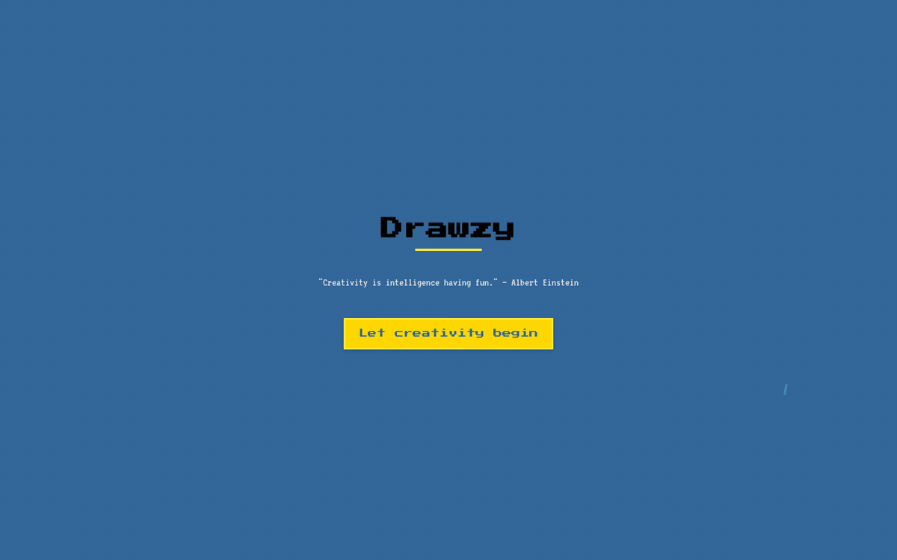
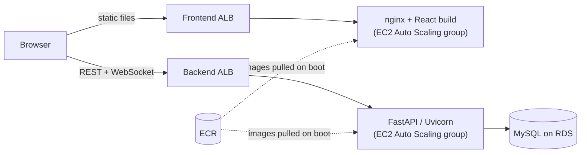

# Drawzy

[](https://github.com/SamLittleJ/Drawzy/actions/workflows/ci.yml)

A real-time multiplayer draw-and-guess game. Players take turns drawing a secret word on a shared canvas while everyone else races to guess it in the chat. The faster you guess, the more points you score.

Built end to end as a portfolio project: a **FastAPI** backend with REST and WebSocket APIs, a **React** frontend, **Docker** images, and **Terraform** infrastructure for AWS deployed through **GitHub Actions**.



*Ana's screen. Bob plays from a second browser: he guesses Ana's volcano, then his sun appears on Ana's canvas stroke by stroke while she guesses it.*

## Features

- **Accounts:** registration and login with bcrypt-hashed passwords and JWT bearer tokens.
- **Rooms:** public or private rooms with a 6-character join code and configurable player limit, drawing time, number of rounds and target score.
- **Draw-and-guess gameplay, run by the server:**
  - every round, each player takes one turn drawing a random word, while the others only see a hint like `_______`;
  - guesses go through the chat: a correct guess stays hidden from the others and scores 10–20 points (faster is better), plus 5 for the drawer;
  - a turn ends when everyone has guessed or time runs out. The game ends after the last round or as soon as someone reaches the target score, and a results screen announces the winner.
- **Real-time play over one WebSocket per player:** live player list with scores, chat, and a canvas (brush, eraser, line, rectangle, circle, fill, clear) streamed from the drawer to everyone else. Players who join or reconnect mid-turn get the drawing so far.
- **Fair play enforced by the server:** only the current drawer can draw, and players who know the word can't post it in the chat.
- **Room lifecycle:** empty rooms are cleaned up automatically, and joins are refused with clear close codes when a room is full or no longer exists.

## Tech stack

| Layer | Technology |
| --- | --- |
| Backend | Python 3.13, FastAPI, SQLAlchemy 2, Alembic, Pydantic 2, PyJWT, bcrypt, Uvicorn |
| Frontend | React 19, React Router, Vite, Axios, CSS Modules, HTML Canvas |
| Data | MySQL 8 (SQLite for local development and tests) |
| Testing | pytest + FastAPI TestClient, Vitest + React Testing Library |
| Infrastructure | Docker, nginx, Terraform, AWS (EC2 Auto Scaling, ALB, RDS, ECR, S3/DynamoDB state) |
| CI/CD | GitHub Actions (tests on every push, manual deploy via OIDC) |

## Architecture



The REST API handles accounts, rooms and chat history. Everything that happens *inside* a room goes through one WebSocket per player at `/ws/{roomCode}?token=<JWT>`:

| Direction | Event | Payload |
| --- | --- | --- |
| client → server | `CHAT` | `{ message }`, which is also how guesses are submitted |
| client → server | `DRAW` | a drawing action, e.g. `{ tool, from, to, color, size }` (current drawer only) |
| client → server | `START_GAME` | — (needs at least two players) |
| client → server | `GET_EXISTING_PLAYERS` | — |
| server → client | `WELCOME` | `{ id, username }` of the connected player |
| server → client | `EXISTING_PLAYERS` | full roster with scores |
| server → client | `PLAYER_JOIN` / `PLAYER_LEAVE` | `{ id, username, score }` / `{ id }` |
| server → client | `CHAT` | `{ user, message }` |
| server → client | `TURN_START` | round, drawer, duration and hint; only the drawer's copy includes the `word` |
| server → client | `DRAW` / `CANVAS_STATE` | one action from the drawer / every action so far, for late joiners |
| server → client | `CORRECT_GUESS` / `WORD` | who guessed and the new scores / the word, for the player who guessed it |
| server → client | `TURN_END` … `GAME_END` | the word and the scores / final leaderboard and winners |
| server → client | `ERROR` | `{ message }`, sent only to the player concerned |

Rejected connections are closed with `4401` (invalid token), `4403` (room full) or `4404` (room not found).

The server owns the game: it picks the words, runs the timer, checks guesses and keeps the scores, so a modified client can't peek at the word or draw out of turn.

Drawing actions are plain JSON objects rendered by a single function ([`drawing.js`](frontend/src/pages/components/drawing.js)), so local strokes and strokes received from other players go through the same code path.

## Getting started

### With Docker (recommended)

```bash
docker compose up --build
```

- Web app: http://localhost:3000
- API docs (Swagger UI): http://localhost:8080/docs

This starts MySQL, the API and the nginx-served frontend. On startup the API applies the database migrations and seeds the word list. Open two browser windows with two accounts to play against yourself.

### Without Docker

Backend (Python 3.11+). Uses a local SQLite file unless `DATABASE_URL` is set (see [`backend/.env.example`](backend/.env.example)):

```bash
python -m venv .venv && source .venv/bin/activate
pip install -r backend/requirements-dev.txt
uvicorn backend.main:app --reload --port 8080
```

Frontend (Node 22). Talks to `http://localhost:8080` unless `VITE_API_URL` is set:

```bash
cd frontend
npm install
npm run dev   # http://localhost:3000
```

## Tests

```bash
# Backend: API, auth, WebSocket protocol, game rules and migrations against in-memory SQLite
pytest

# Frontend: room state reducer, canvas rendering, game screens and routing
cd frontend && npm test
```

CI runs both suites, `ruff`, a production build of the frontend, `terraform validate` and both Docker builds on every push and pull request.

### Database migrations

The schema is managed with Alembic in [`backend/migrations`](backend/migrations) and upgraded automatically when the API starts. The test database is built by the same migrations, and a test fails if the models and migrations drift apart. After changing a model, generate a new migration:

```bash
alembic -c backend/alembic.ini revision --autogenerate -m "describe the change"
```

## Deployment

The AWS environment is described in [`terraform/`](terraform):

- **`bootstrap/`:** one-time S3 bucket and DynamoDB table for remote Terraform state.
- **`modules/ecr`:** container registries for both images.
- **`modules/rds_mysql`:** private MySQL instance.
- **`modules/ec2_backend` and `modules/ec2_frontend`:** an Auto Scaling group behind an Application Load Balancer for each service. Instances pull the latest image from ECR on boot.
- **`environments/dev/`:** wires the modules together (copy `terraform.tfvars.example` to get started).

The [Deploy workflow](.github/workflows/deploy.yml) is triggered manually. It authenticates to AWS with GitHub OIDC (no stored access keys), creates the registries and database, builds and pushes both images, then plans and applies the rest of the stack. Secrets such as the database password and JWT key are passed as `TF_VAR_*` variables from GitHub secrets. The workflow header lists the required repository settings.

> The AWS environment is not kept running. Use Docker Compose to try the project locally.

## Project structure

```
backend/
  main.py                 app setup, CORS, startup (migrations + word list)
  routers/                REST endpoints and the WebSocket room channel (ws.py)
  game.py                 draw-and-guess rules: turns, guesses, scoring, end of game
  events.py               WebSocket event names
  connection_manager.py   open sockets per room and the player behind each one
  seed.py                 default word list
  models.py, schemas.py   SQLAlchemy models and Pydantic schemas
  migrations/             Alembic migrations
  security.py             password hashing and JWT helpers
  tests/                  pytest suite
frontend/
  src/pages/              pages, room state reducer, game components and their tests
terraform/                bootstrap, reusable modules and the dev environment
.github/workflows/        CI and manual deploy
docker-compose.yml        local MySQL + API + web stack
```

## Design notes and limitations

- **One backend instance per game.** Room connections and running games live in process memory, so all players of a room must reach the same backend instance. Running several instances would need shared state, such as Redis, between them.
- **Scoring.** A correct guess is worth 10 points plus up to 10 more depending on the time left; the drawer earns 5 per correct guess. The constants live at the top of [`game.py`](backend/game.py).
- **No HTTPS in the Terraform setup.** The load balancers only listen on HTTP. A real deployment would add an ACM certificate and an HTTPS listener.

## License

Released under the [MIT License](LICENSE). Copyright (c) 2025-2026 Ciuraru Samuel-Junior.
